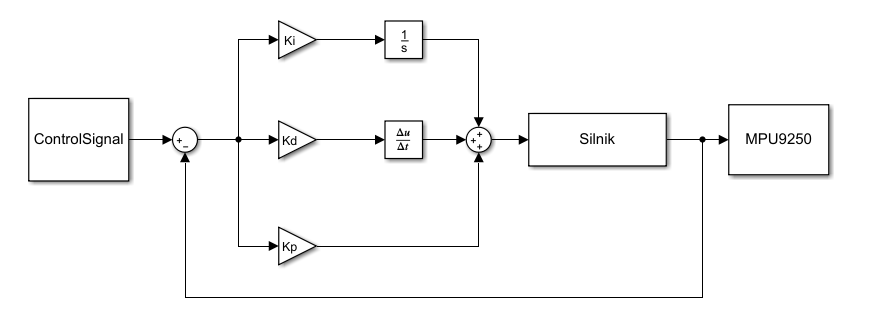
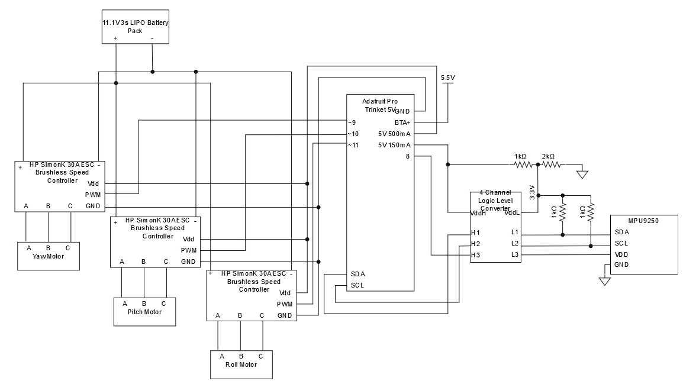

Inicjalizacja mikrokontrolera
=============================

W pierwszej fazie działania mikrokontroler Adafruit Pro-Trinket 5v inicjalizuje
potrzebne zmienne oraz wyjścia potrzebne do działania systemu. Z pinów
wyjściowych inicjalizujemy tylko piny LED, które sygnalizują powodzenie
inicjalizacji czujnika oraz pin logiczny włączający czujnik. Pin analogowe PWM
oraz piny odczytu interfejsu I2C nie potrzebują inicjalizacji.

Inicjalizacja i kalibracja czujnika
===================================

Sterownik czujnika MPU9250 działa na podstawie programu napisanego przez Krisa
Winera udostępnionego na podstawie licencji Beerware(niewyegzekwowana) oraz
algorytmów open-source do obliczania pozycji filtrów napisanych przez Madgwick
oraz Mahony.

MPU2950 jest czujnikiem Inertial Measurement Unity o 9 stopniach swobody.
Liczymy po 3 osie dla trzech czujników: żyroskopu mierzącego prędkość kątową
wzdłuż osi, akcelerometru mierzącego przyśpieszenie oraz magnetometru mierzącego
natężenie pola magnetycznego ziemi.

W pierwszej kolejności czujnik inicjalizuje połącznie i sprawdza jego stan
odczytując bity magistrali własnego adresu w interfejsie protokołu I2C.

Przy powodzeniu, przeprowadzony zostaje self-test sprawdzający funkcjonalność
podzespołów czujnika oraz kalibracja położenia i rozdzielczości podzespołów.

Główna pętla działania - odczytanie danych z czujnika
=====================================================

Mikrokontroler w swojej głównej pętli odczytuje wartości odczytane z czujników.
Następnie wykorzystany zostaje wspomniany wcześniej algorytm do obliczania
kwaternionów położenia. Ostatecznie otrzymujemy 9 wartości:

Z żyroskopu prędkość kątową w stopniach na sekundę

Z akcelerometru przyśpieszenie kątowe w stopniach na sekundę kwadrat.

Z obliczone wychylenie kątowe w stopniach.

Każda z tych wartości jest podana w trzech osiach.

Główna pętla działania – regulator PID
======================================

Dzięki wbudowanym wielu czujnikom oraz zastosowanemu programowi, mikrokontroler
sam w sobie w czasie rzeczywistym realizuje funkcje całkowania i różniczkowania
sygnału. Obieramy, jako wartość wejściową, prędkość kątową z żyroskopu. Wtedy
algorytm kwaternionów staje się czynnikiem całkującym, a odczyt z akcelerometru
czynnikiem różniczkującym.

Na początku programu zainicjowaliśmy zmienne potrzebne do realizacji reszty
funkcjonalności regulatora PID. Zainicjowaliśmy po 3 współczynniki Kp, Kd i Ki,
odpowiednio dla każdej osi działania, wartości ‘input’, będące sygnałem
sterującym pozycją stabilizatora oraz wartości ‘MaxValue’ służące do
przeskalowania sumy współczynników regulatora, aby zadać odpowiedni sygnał PWM
na wyjściach.

Model regulatora, rozłożony dla pojedynczej osi, jest standardowym modelem
systemu z negatywnym sprzężeniem zwrotnym.

Aby była możliwość sterowania silnikiem wstecz nominalną wartość odpowiadającą
zatrzymaniu się silnika jest 127.5. Ta wartość zostaje zsumowana z sygnałem
wyjściowym z regulatora. Sygnał ten jest różnicą wartości sterującej pozycją
‘input’ oraz wartościami wymnożonych współczynników regulatora i wartości
zmierzonych przez czujnik. Różnica ta wynika z ujemnego sprzężenia zwrotnego.
Ponieważ chcemy, aby prędkość kątowa i przyśpieszenie zawsze były równe 0 nie
realizujemy dla nich sygnałów wejściowych tylko po prostu liczymy je, jako
różnice. Otrzymana różnica zostaje przeskalowana przez wartość maksymalną tak,
aby znalazła się w zakresie -127.5 i +127.5. Otrzymana ostateczna wartość z
zakresu od 0 do 255 jest zadawana, jako sygnał na PWM dla kontrolera prędkości
silnika. Silnik porusza się do zadanej pozycji, obracając przy tym czujnik, a on
odczytuje nowe wartości, realizując fizycznie w ten sposób pętle sprzężenia
zwrotnego. Oczywiście ten sam algorytm jest realizowany w trzech osiach dla
różnych, odpowiednio fabrycznie skalibrowanych wartości współczynników
regulatora i zmiennych wejściowych.

Uwagi
=====

Połączenie zrealizowane jest w interfejsie I2C, który przy dobranym
mikrokontrolerze może działać maksymalną prędkością taktowania ok 1kHz. Nie jest
to ograniczenie spowodowane przez mikrokontroler, lecz przez samo
oprogramowanie. Idealny byłoby zastąpienie interfejsu I2C przez SPI, który może
działać z prędkością nawet 1MHz. Wadą jest jednak koniczność zastosowania
dodatkowych kabli, które w projekcie, gdzie musimy użyć ich możliwie jak
najmniej może nie być możliwe, tym bardziej biorąc pod uwagę, że kable te muszą
znaleźć się w końcówce manipulatora.

Schemat elektryczny stabilizatora
=================================

